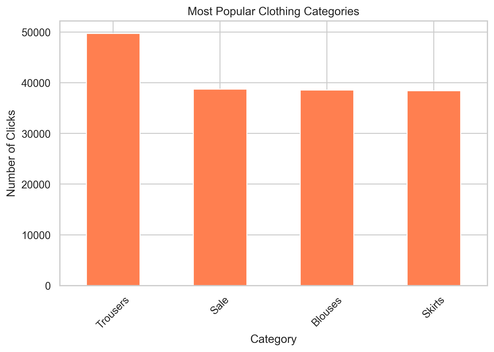
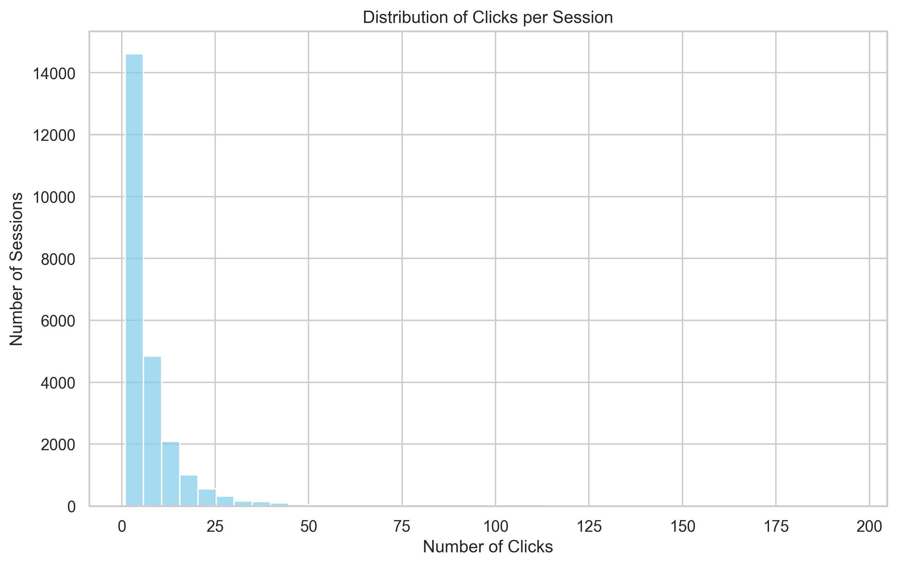
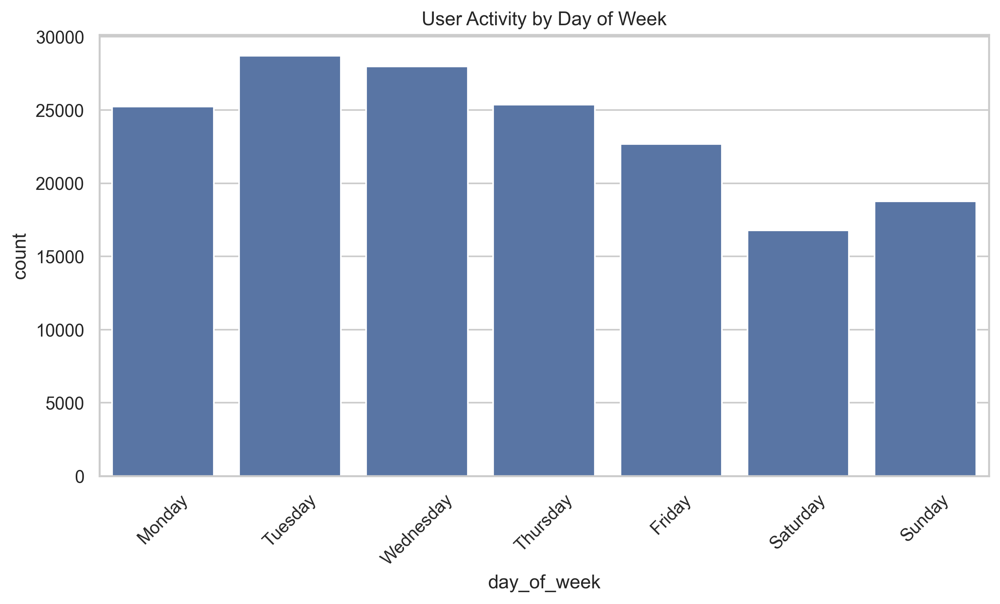
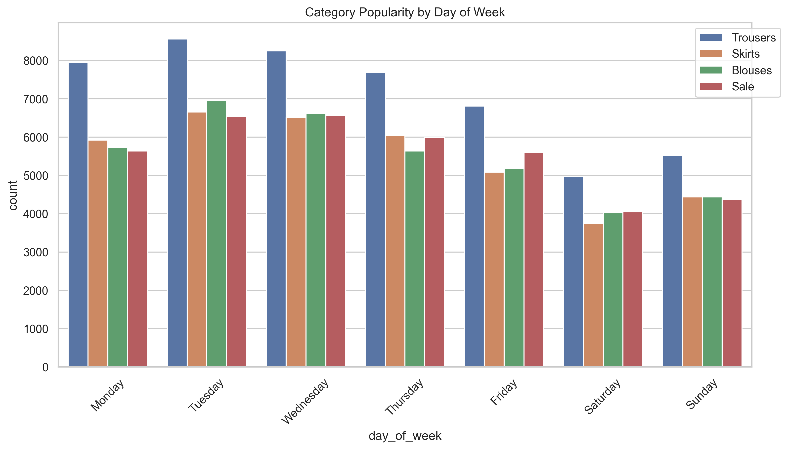
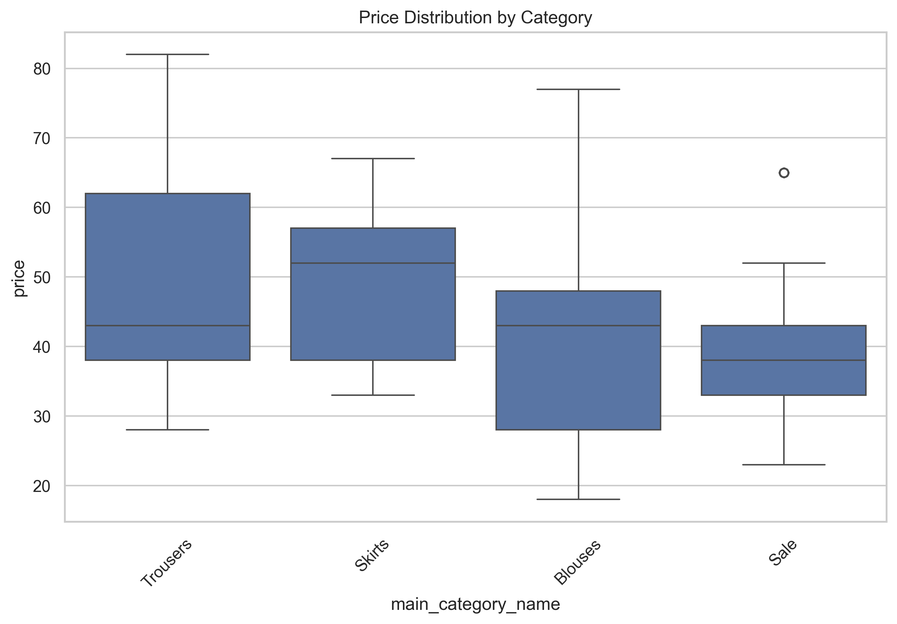
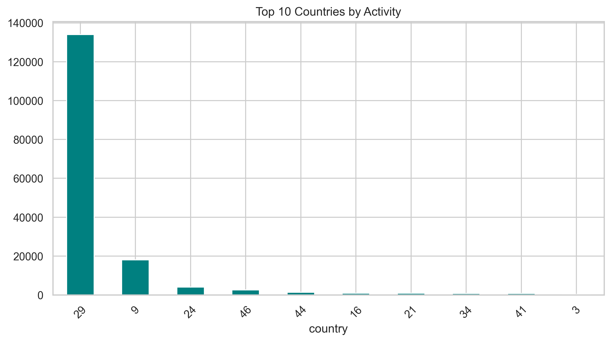

# 🛍️ E-commerce Clickstream Analysis

End-to-end analysis of user behavior on an online clothing store using clickstream data.

## 🚀 Live Dashboard
**Live App:** [Click here to view Dashboard](https://ecommerce-clickstream-analysis-et6otmojgks5rccv9ahd76.streamlit.app)

## 📋 Project Overview
This project demonstrates complete clickstream analysis — from data cleaning to deriving business insights and building an interactive dashboard.

### 🎯 Objectives
- Perform Exploratory Data Analysis on clickstream data
- Sessionization and user path analysis
- Identify popular categories, drop-offs, and temporal patterns
- Provide actionable business recommendations

### 🛠 Tech Stack
- **Python**: Pandas, NumPy
- **Visualization**: Matplotlib, Seaborn, Plotly
- **Dashboard**: Streamlit
- **Tools**: Jupyter Notebooks

### 📊 Dataset
- E-shop clothing 2008 dataset (~165,000 click events)
- Time Period: April to August 2008

### 📈 Key Visualizations

---

### 🔍 Main Findings

- **Trousers** is the most popular category (~49,000 clicks)
- Most sessions are very short (high bounce rate)
- Highest activity on **Tuesday** and **Wednesday**
- **Country 29** dominates the traffic (over 80%)
- Trousers have the highest price range

---

### 💡 Business Recommendations

- Make **Trousers** the flagship category on homepage
- Improve UX to reduce high bounce rate
- Run special promotions on weekends
- Focus marketing efforts primarily on Country 29

## Project Structure

├── notebooks/                  # All analysis notebooks
├── visualizations/             # Saved plots and images
├── app.py                      # Streamlit Dashboard
├── requirements.txt
├── README.md
└── .gitignore

Author
Venkata Geetha lakshmi Gunda - Data Analysis Portfolio Project
